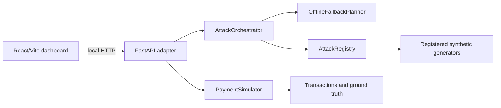

# AI-Defense-Lab

This project is a synthetic payment-security laboratory for offline red-team attack planning and attack-data generation.

## Red Team Control Center

The local dashboard adds a thin HTTP presentation layer over the existing Python engine:



The frontend never generates simulation data or attack results. The backend discovers attacks from `AttackRegistry`, calls the existing planner and generators, and serializes their real records for the dashboard.

### Start locally

From the repository root, in separate terminals:

```bash
./.venv/bin/python -m pip install -r requirements.txt
./.venv/bin/python -m uvicorn backend.main:app --reload --port 8000
npm --prefix frontend run dev
```

Open `http://localhost:5173`. The API is available at `http://localhost:8000`, with interactive docs at `/docs`.

### Control-center API

- `GET /api/health`
- `GET /api/attacks`
- `GET /api/population/summary`
- `POST /api/dataset/generate`
- `GET /api/customers` and `GET /api/customers/{customer_id}`
- `GET /api/merchants`
- `GET /api/transactions` and `GET /api/transactions/{transaction_id}`
- `POST /api/planner/plan`
- `POST /api/attacks/run`
- `POST /api/attacks/run-all`
- `GET /api/runs/{run_id}`

The default planner is offline. OpenAI remains optional and is never required by the dashboard. All displayed values are synthetic, and communication/media generators remain metadata-only `.test` artifacts.

### Attack library

The dashboard dynamically displays and executes all currently registered families: behavioral drift, device switch, velocity anomaly, phishing, vishing, video deepfake metadata, synthetic identity, account takeover, sleeper transaction pacing, and adversarial probing.

### Synthetic scenarios

`SyntheticScenario` is the neutral, reproducible context contract between the synthetic world and the existing planner. It contains a `scenario_id`, `scenario_type`, target and transaction IDs, timestamp, observable context blocks (`transaction_context`, `behavioral_context`, `device_context`, `location_context`, `communication_context`, `identity_context`, `classifier_context`, and `timeline_context`), separate `ground_truth`, and generation metadata. Ground truth is excluded from `observable_context()` before planning.

The scenario generator supports:

| Scenario | Applicable registered attacks |
| --- | --- |
| `TRANSACTION_ANOMALY` | behavioral drift, device switch, velocity anomaly, account takeover |
| `COMMUNICATION_SCAM` | phishing, vishing when voice context exists, account takeover |
| `KYC_IDENTITY` | synthetic identity, video deepfake |
| `LONGITUDINAL_BEHAVIOR` | sleeper transaction pacing, behavioral drift, velocity anomaly |
| `CLASSIFIER_EVALUATION` | adversarial probing |

Use `POST /api/attacks/run` with `scenario_type` to generate a scenario, pass its observable evidence through the existing planner, and execute the selected registered generator. Explicit machine-readable scenario batches are available through `POST /api/scenarios/dataset?number_of_scenarios=1000&seed=7`; startup does not create large files automatically.

### Testing

```bash
python3 -m unittest discover -s tests -v
./.venv/bin/python -m unittest tests.test_backend_api -v
npm --prefix frontend run build
```

## Blue Team Dataset Export

Generate the substantial latest dataset from the current simulator and scenario implementation:

```bash
./.venv/bin/python scripts/generate_latest_dataset.py
```

The reproducible output is written to `data/latest/` with seed `2026`: `customers.csv`, `merchants.csv`, `transactions.csv`, `scenarios.jsonl`, `ground_truth.jsonl`, and a dataset-specific `README.md`. The transaction target is `is_fraud`; hidden attack metadata is kept in `ground_truth.jsonl`.
## Environment setup

To enable the optional OpenAI-backed planner, export an API key before running the app:

```bash
export OPENAI_API_KEY="your-api-key-here"
export OPENAI_MODEL_NAME="gpt-4o-mini"
```

Do not commit real secrets. Keep environment variables local to the shell or a local `.env` file that is ignored by git.

## Notes

- The application remains fully functional without credentials.
- If no valid OpenAI credentials are configured, the system automatically uses the offline fallback planner.
- The planner is LLM-powered only when credentials are present; it is not trained or fine-tuned in this repository.
